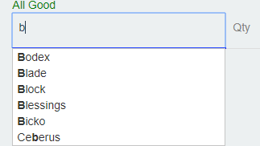
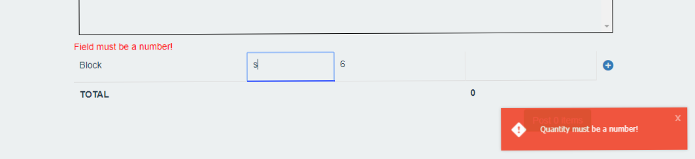

# ng-pos
## Running ng-pos

ng-pos requires a backend service that sends json data.
Documentation for such a service is not yet provided
But a static demo for this app can be found here: [DEMO](https://ericnjuki.github.io/hemedisapp)

This is how the app works:
You have 5 different views

### 1. Record Transactions
This is the default landing page/view and cannot be changed.
This is where you record transactions i.e sale or purchase.
You do this by typing name of item in the item field:

and picking one from the suggestions. If the item you are trying to transact with is not in the suggestions, you will not be allowed to post the transaction. Why?
An item must exist in your records for you transact with it! This is key to maintaining integrity of your data.

Fill in the rest of the fields. And add the item to current transaction by pressing Enter of clicking the add button. 

This validates the fields and produces errors if something isn't right.

You can add multiple items to the same transaction!

Don't forget to put in the date:

When you're done, post the transaction. You should get a notification if it's successful.

### 2. Recent Transactions
Self explanatory. The inspiration for this view came from a typical receipt book:

The more recent ones appear first

You have the ability to delete transactions which is present only if you realise you made an error after posting.
WARNING: it is not recommended to delete transactions especially purchases which still count to your statistics even when deleted. Coupled with deleted items, and you have very messy records.

Each 'receipt' shows :
    i. date of transaction
    ii. type of transaction
    iii. items.. transacted, their totals
    iv. total amount of all items in transaction

### 3. Statistics
This view is for showing 3 major stats on a monthly basis:

    i. sales profit - to show how much you actually earned; calc by taking selling price - buying price of each item x quantity

    ii. sales - total amount of sales (to show how much you sold that month)

    iii. purchases - total amount of purchases (to show amount you of money you spent that month)

If you click back to 2015, you will see the stats for the transaction we just recorded:

### 4. Current Stock
Here you can view all items in your inventory
You can perform certain actions such as sort, search, edit and delete one or many items.

WARNING: It is not recommended to delete items unless you have duplicates. You can discover duplicates when recording transactions. If an item is suggested twice, there's a duplicate. Delete it immediately as it will mess up your statistics.

### 5. Add New Items
Here you, add items that are NOT already in your inventory. If the item is in your inventory, you should update it in Current Stock.
Quantity and Unit fields are optional and default to 0 and pc respectively. This is dangerous as when you sell items with 0 quantity, they quantity goes negative (this doesn't affect the statistics though)

## Typical work flow
1. You begin your workflow by adding (a) new item(s) in the Add New Items tab.
2. You then go to Record Transactions and click either Purchase or Sale tab (it's on Sale by default)
3. Set the date using the date picker
4. Add items to the transaction
5. Post the transaction
6. Check your recent transactions, statistics, stock as required.

