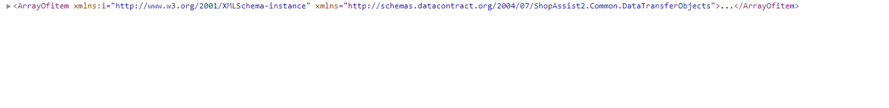
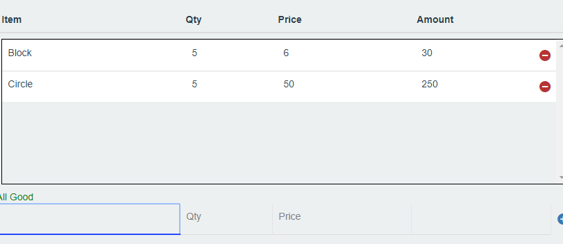
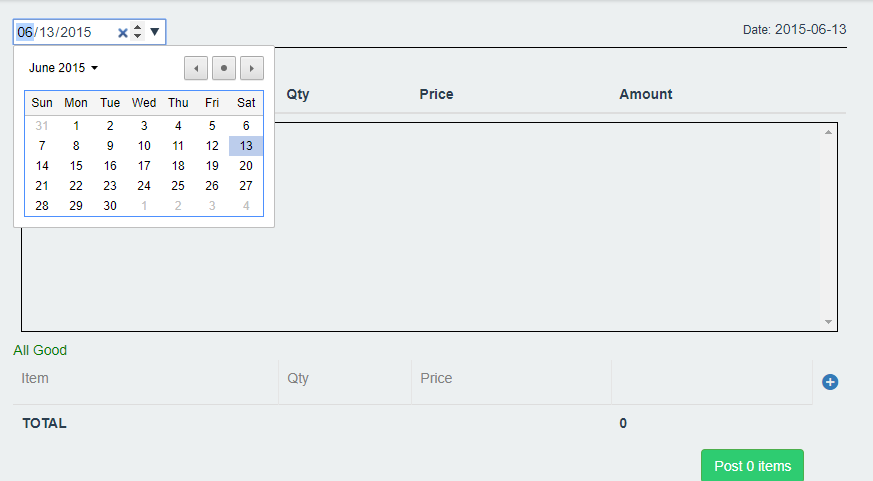
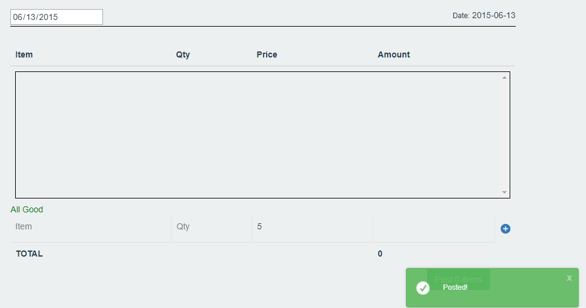
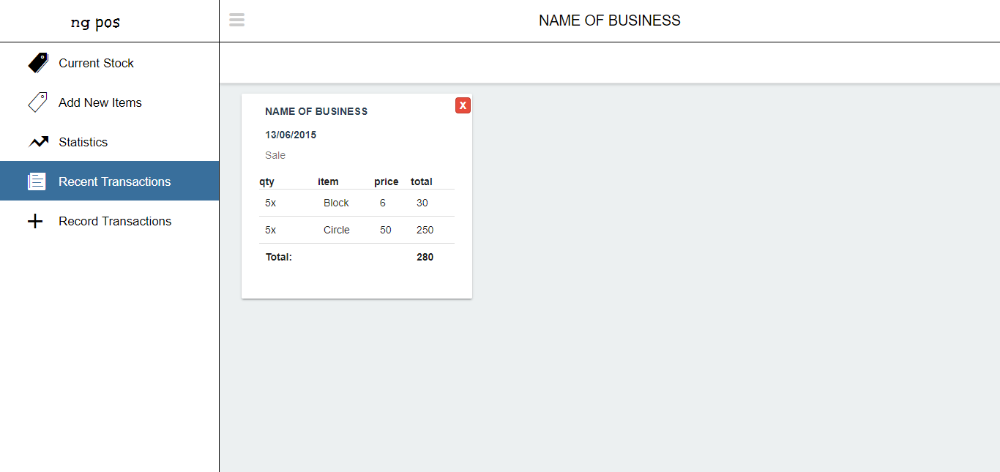
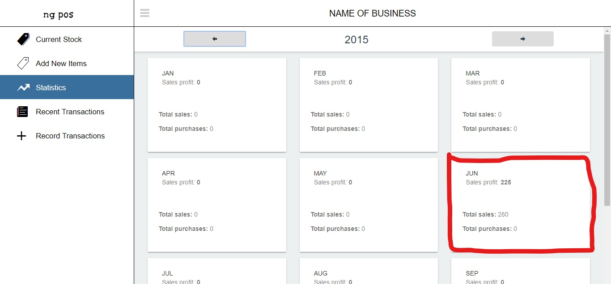

# ng-pos

___ng-pos___ is a web application built using angular javascript framework. Its job? Simple inventory management and logging sales/purchases and displaying monthly profit, sales and purchases. That's it.
See **Running the app** section below for instructions on how to deploy.

## DEMO

___ng-pos___ requires a backend service that sends json data.
~~Documentation for such a service is not yet provided~~. The api is on my github [here](https://github.com/ericnjuki/ngpos-api) but a static demo for this app can be found here: [DEMO](https://ericnjuki.github.io/hemedisapp).

## Running the app

The app has been tested on the following setup:
* Windows 10 Home
* Chrome  63.0.3239.84 (64-bit)

and is NOT guaranteed to work elsewhere :/

* #### Building and Deploying the app locally (on IIS or APACHE), PART I
 * ###### Step 1
    You can download the dist folder [here](https://github.com/ericnjuki/hemedisapp/releases/download/v0.1.1/dist.zip) and skip to [*Step 6*](#step-6).

 * ###### Step 1

    pull master branch on this repository and run `npm -i` in the folder containing `package.json` file on your command line to install the required dependencies

 * ###### Step 2

    Ensure you have angular 4+ installed, run `ng serve` and browse `localhost:4200` on your browser (check supported browsers above) to ensure the app works. Don't mind the console 404 error for localhost:1111...., we'll get to that.
    If this Step doesn't work, try debugging or file an issue or (not recommended) contact dev.

 * ###### Step 3

    Open `src/app/services/items.service.ts`
    and change the value of `_url` from `http://localhost:1111/api/v1.0/items/` to `path/to/where/you'll/host/service/api/v1.0/items/`

    And do the same for `src/app/services/transacs.service.ts`
 * ###### Step 4

    build the app by running `ng build -prod -bh "./"`
    This creates a `dist` folder in the project

 * ###### Step 5 Add a Web.config if on IIS

    Create a file, call it Web, give it .config extension, and copy this into it and save it in your dist folder

    ```C#
    <configuration>
        <system.webServer>
            <rewrite>
            <rules>
                <rule name="Main Rule" stopProcessing="true">
                        <match url=".*" />
                        <conditions logicalGrouping="MatchAll">
                            <add input="{REQUEST_FILENAME}" matchType="IsFile" negate="true" />
                            <add input="{REQUEST_FILENAME}" matchType="IsDirectory" negate="true" />
                        </conditions>
                        <action type="Rewrite" url="/" />
                    </rule>
                </rules>
            </rewrite>
        </system.webServer>
    </configuration>
    ```
 * ###### Step 6

    (IIS) copy dist folder contents to a new folder from where you want the app to be served, create new IIS website pointing to this folder.

    (APACHE) copy dist folder to `htdocs` folder, (and rename it). Browse `localhost:8080/dist` to access the app

    _For other deployment options, search how to deploy angular apps._

* #### Building and Deploying the app locally (on IIS or APACHE) PART II

    Now we need to set up the api.

 * ###### Step 1
    Download the api files [here](https://github.com/ericnjuki/ngpos-api/files/1567375/ng-posAPI.zip)

 * ###### Step 2: Deploy!
    copy the files into a folder called `ng-posAPI` and put the folder in `htdocs` folder to deploy to APACHE and access it via `http://localhost:8080/ng-posAPI`
    
    or create website on IIS and point it to where `ng-posAPI` is.

    Try accessing this url :

    `http://localhost:8080/ng-posAPI/api/v1.0/items/g`
    for apache and

    `http://localhost:{set port}/api/v1.0/items/g`
    for IIS

    *Make sure this is the url pointed to by the app as in [Part I Step 3](#step-3) above.*
    Mine was deployed to http://localhost:1111

    You should see something similar to this on the browser:
    


    _For other deployment options, search how to deploy ASP.NET WebAPI 2 applications._

You can now visit the deployed angular site and Try interacting with the site; Instuctions below:

* ##### This is how the app works:
You have 5 different views:

 * ### 1. Record Transactions
    This is the default landing page/view and cannot be changed.
    This is where you record transactions i.e sale or purchase.

    I have reworked this view a bit in v0.2.0 to include a searchable table of items right next to what I call
    'the receipt'. 
    - You can now just find the item you're interested in quickly, and click on it to add it to the receipt.
      You can click on it repeatedly to increase its quantity!
      The receipt is now also editable so you can change prices of items as you see fit.

    - You can add multiple items to the same transaction!

        

    - Don't forget to put in the date:

        

    - When you're done, post the transaction. You should get a notification if it's successful.

        

* ### 2. Recent Transactions
    Self explanatory. The inspiration for this view came from a typical receipt book:

    

    In v0.2.0, I have added buttons for each month and a dropdown for + or - 4 years from the current year
    which when chosen, show all the transactions for that month in that year.
    The more recent ones appear first

    You have the ability to delete transactions which is present only if you realise you made an error after posting.
    WARNING: it is not recommended to delete transactions especially purchases which still count to your statistics even when deleted. Coupled with deleted items, and you have very messy records.

    Each 'receipt' shows :
        i. date of transaction
        ii. type of transaction
        iii. items.. transacted, their totals
        iv. total amount of all items in transaction


* ### 3. Statistics
    This view is for showing 3 major stats on a monthly basis:

        i. sales profit - to show how much you actually earned; calc by taking selling price - buying price of each item x quantity

        ii. sales - total amount of sales (to show how much you sold that month)

        iii. purchases - total amount of purchases (to show amount you of money you spent that month)

    If you click back to 2015, you will see the stats for the transaction we just recorded:

    

* ### 4. Current Stock
    Here you can view all items in your inventory
    You can perform certain actions such as sort, search, edit and delete one or many items.

    WARNING: It is not recommended to delete items unless you have duplicates. You can discover duplicates when recording transactions. If an item is suggested twice, there's a duplicate. Delete it immediately as it will mess up your statistics.

* ### 5. Add New Items
    Here you, add items that are NOT already in your inventory. If the item is in your inventory, you should update it in Current Stock.
    Quantity and Unit fields are optional and default to 0 and pc respectively. This is dangerous as when you sell items with 0 quantity, they quantity goes negative (this doesn't affect the statistics though)

* ### 6. Batch Add
    This is a new (v0.2.0) view that enables you to add large amounts of data to the system. (You previously had
    to add each item 1 by 1 to the system. Yes, developers are stupid at times)
    The textarea where you paste is disabled. Type in __hibbyjibbies__ in the password field to unlock

    I did this because this is a one-or-two-time view and really isn't designed to be an entry point to the system (it has no validation of items so be careful what you copy paste)

    The format of data that should go in there is e.g. excel data (rows separated by newline '\n' and columns by tabs '\t') and as I type this I just remembered that the column headers are hard-coded so sounds like v0.2.1 is coming out soon.

## Typical work flow
1. You begin your workflow by adding (a) new item(s) in the Add New Items tab.
2. You then go to Record Transactions and click either Purchase or Sale tab (it's on Sale by default)
3. Set the date using the date picker
4. Add items to the transaction
5. Post the transaction
6. Check your recent transactions, statistics, stock as required.

### A couple of things I did wrong with this one
1. Started using and depended on jQuery from the start, instead of *first* trying to find an 'Angular way'. This led to underuse of a lot of sweet angular features.
1. Rewrote my form validation instead of using already established, better form-validation solutions, and Form elements instead of contenteditable would probably have been best.
1. Used more than one UI framework (angular-material + bootstrap)
1. Bad design, bad UI, didn't think of user.
1. Spent too much time initially working on UI instead of getting the app to work first. This led to a lot of late stage undiscovered bugs which were frustrating to say the least.
1. Used a template and went ahead to rewrite it almost completely. Note to self: If you're gonna use a template, might aswell.. use it.

kudos for making it all the way here! :clap: